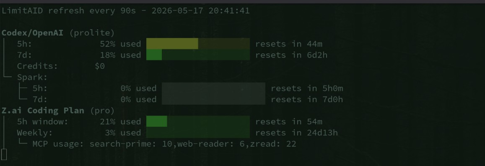

# LimitAID

`LimitAID` is a bash CLI that shows quota, balance, and usage limits for several AI providers from one place.

Supported providers:

- `codex`: Codex / OpenAI Coding limits, including Spark when present
- `openrouter`: OpenRouter key balance and usage
- `zai`: Z.ai coding plan limits and MCP/tool usage
- `all`: run all providers sequentially

## Requirements

- `bash`
- `curl`
- `jq`

## Install / Run

Run from this repository:

```bash
./limitaid codex
./limitaid zai
./limitaid openrouter
./limitaid all
./limitaid all --loop 30
```

If you want shell completion in bash:

```bash
source ./completely.bash
```

To make it persistent:

```bash
echo 'source /absolute/path/to/LimitAID/completely.bash' >> ~/.bashrc
```

## Top-Level Usage

```bash
./limitaid <provider>
```

Providers:

- `codex`
- `openrouter`
- `zai`
- `all`

Top-level help:

```bash
./limitaid --help
./limitaid --version
```

## Subcommands

### `codex`

Show Codex/OpenAI quota usage.

```bash
./limitaid codex
./limitaid codex --json
./limitaid codex --conf /path/to/keys.conf
./limitaid codex --provider-config 'codex::<access_token>[::<name>]'
```

What it reads:

- plan type
- primary window usage (usually 5h)
- secondary window usage (usually weekly)
- credits balance
- Spark limits from `additional_rate_limits` when present

Auto-discovery:

- Reads `~/.codex/auth.json`
- Uses `.tokens.access_token`

API used:

- `GET https://chatgpt.com/backend-api/wham/usage`

### `openrouter`

Show OpenRouter key balance and usage.

```bash
./limitaid openrouter
./limitaid openrouter --json
./limitaid openrouter --name work
./limitaid openrouter --conf /path/to/keys.conf
./limitaid openrouter --provider-config 'openrouter::<api_key>[::<name>]'
```

What it reads:

- key label
- configured credit limit
- remaining credits
- daily usage
- weekly usage
- monthly usage
- free-tier flag

Auto-discovery:

- none

Important behavior:

- If no OpenRouter keys are configured, that is treated as a normal state.
- By default it stays quiet and exits successfully.
- To see the informational message, use verbose level 2:

```bash
./limitaid openrouter --verbose 2
```

API used:

- `GET https://openrouter.ai/api/v1/key`

### `zai`

Show Z.ai coding plan usage.

```bash
./limitaid zai
./limitaid zai --json
./limitaid zai --name personal
./limitaid zai --conf /path/to/keys.conf
./limitaid zai --provider-config 'zai::<api_key>[::<name>]'
```

What it reads:

- plan level
- `TIME_LIMIT` usage (usually the 5h coding window)
- `TOKENS_LIMIT` usage
- MCP/tool usage breakdown from `usageDetails`

Auto-discovery:

- Reads `~/.config/opencode/opencode.json`
- Uses `.provider."zai-coding-plan".options.apiKey`

API used:

- `GET https://api.z.ai/api/monitor/usage/quota/limit`

Notes:

- `nextResetTime` from Z.ai is returned in milliseconds internally and is converted before display.

### `all`

Run all providers sequentially.

```bash
./limitaid all
./limitaid all --json
./limitaid all --conf /path/to/keys.conf
./limitaid all --loop 60
```

This runs:

1. `codex`
2. `openrouter`
3. `zai`

Loop mode:

- `--loop <seconds>` reruns the full sequence continuously
- minimum effective interval is `30` seconds
- if a lower value is provided, LimitAID automatically uses `30`
- loop mode clears the terminal and redraws each cycle



## Common Options

Available on subcommands:

- `--json`: print raw provider JSON
- `--conf <file>`: custom key config file
- `--provider-config '<provider>::<key>[::<name>]'`: inject a key directly

Available on `openrouter` and `zai`:

- `--name <name>`: select a configured key by name

## Configuration File

Default path:

```bash
~/.config/limitaid/keys.conf
```

Format:

```ini
# <provider>_<name>=<path_to_file_containing_key>
openrouter_work=/home/user/.secrets/openrouter_work
openrouter_personal=/home/user/.secrets/openrouter_personal
zai_personal=/home/user/.secrets/zai_personal
codex_work=/home/user/.secrets/codex_work
```

The referenced file should contain the raw key value.

Example file contents:

```bash
cat ~/.config/limitaid/keys.conf
```

See also:

- `keys.conf.example`

## Key Resolution Order

For every provider, keys are loaded in this order:

1. config file entries
2. `--provider-config` override replaces discovered/configured keys
3. auto-discovery is used only if no keys were loaded yet

Auto-discovery support:

- `codex`: yes
- `zai`: yes
- `openrouter`: no

## Output Modes

### Pretty output

Human-readable bars and summaries, for example:

```text
Codex/OpenAI (prolite)
│  5h:             31% used ██████░░░░░░░░░░░░░░ resets in 3h28m
│  7d:             15% used ███░░░░░░░░░░░░░░░░░ resets in 6d5h
│  Credits:       $0
└─ Spark:
   ├─ 5h:              0% used ░░░░░░░░░░░░░░░░░░░░ resets in 5h0m
   └─ 7d:              0% used ░░░░░░░░░░░░░░░░░░░░ resets in 7d0h
```

### JSON output

```bash
./limitaid codex --json
./limitaid zai --json
./limitaid openrouter --json
./limitaid all --json
```

This prints the raw provider response payloads.

## Examples

Use auto-discovered Codex token:

```bash
./limitaid codex
```

Use a specific OpenRouter key from config:

```bash
./limitaid openrouter --name work
```

Inject a Z.ai key directly:

```bash
./limitaid zai --provider-config 'zai::your-api-key::temp'
```

Query everything with a custom config file:

```bash
./limitaid all --conf ~/.config/limitaid/keys.conf
```

Show the OpenRouter no-key informational message:

```bash
./limitaid openrouter --verbose 2
```

## Exit Behavior

- `codex` and `zai` return non-zero when their live API call fails
- `openrouter` returns `0` when no keys are configured
- `openrouter` returns non-zero only for actual command/setup failures, not for the absence of configured keys
- `all` returns the last non-zero subcommand exit code it observes

## Bash Completion

This repository includes a bash completion script:

- `completely.bash`

Load it for the current shell:

```bash
source ./completely.bash
```

It completes:

- top-level providers: `codex`, `openrouter`, `zai`, `all`
- common flags like `--json`, `--conf`, `--provider-config`
- provider-specific flags like `--name`

## Project Files

```text
limitaid            Main entrypoint
bin/codex           Codex/OpenAI + Spark command
bin/openrouter      OpenRouter command
bin/zai             Z.ai command
bin/all             Aggregate command
lib/config.sh       Key loading and auto-discovery
lib/http.sh         HTTP helpers
lib/time.sh         Time formatting helpers
lib/output.sh       Pretty output helpers
keys.conf.example   Config example
completely.bash     Bash completion script
```
